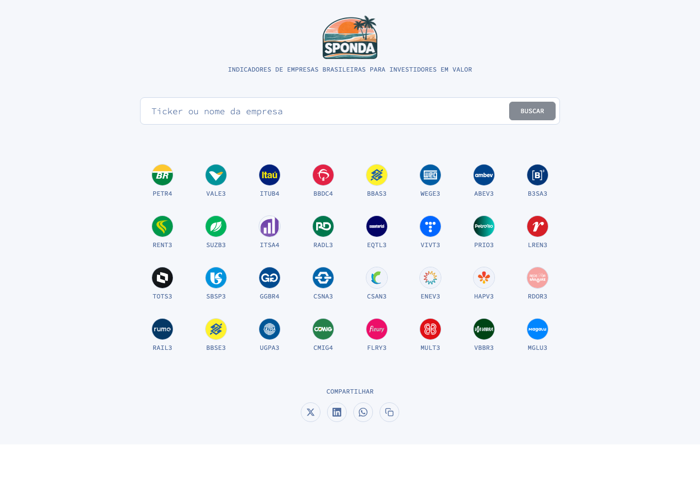

# Sponda

Financial indicators and analytics for global public companies. Over 23,000 companies listed across the U.S. and Brazil. Live at
<a href="https://sponda.capital" target="_blank" rel="noopener noreferrer">sponda.capital</a>.
.



## Performance

### Database

- **Trigram indexes** (pg_trgm) on `Ticker.display_name` and `symbol` for sub-millisecond ILIKE search across 23K+ tickers
- **Composite indexes** on `CompanyAnalysis(ticker, -generated_at)`, `LookupLog(user, timestamp)`, `LookupLog(session_key, timestamp)`
- **PostgreSQL tuning** for SSD + 2 GB RAM: `shared_buffers=512MB`, `work_mem=8MB`, `random_page_cost=1.1`
- **pg_stat_statements** enabled for query performance monitoring

### Caching (Redis)

Three-layer caching strategy eliminates redundant external API calls:

**Layer 1 · Provider cache** (in `providers.py`): raw external API responses (BRAPI/FMP) are cached at the routing layer, so multiple views that need the same data (e.g. `fetch_quote`, `fetch_historical_prices`) share a single external call.

| Provider call | TTL |
|---|---|
| `fetch_quote` | 15 min |
| `fetch_historical_prices` | 1 hour |
| `fetch_dividends` | 1 hour |

**Layer 2 · View cache**: computed results for each API endpoint.

| Endpoint | TTL | What it avoids |
|---|---|---|
| Ticker list (27K rows) | 1 hour | Full table scan on every page load |
| Search results | 2 min | Trigram query + sorting per keystroke |
| PE10 metrics | 4 hours | 6+ DB queries + external API call + inflation adjustment |
| Fundamentals | 6 hours | All balance sheets, earnings, cash flows + IPCA table + external API |
| Multiples history | 6 hours | 2 sequential external API calls (was 8s uncached) |

**Layer 3 · Cache warming**: `python manage.py warm_cache` pre-populates all three endpoints for the top 50 most-queried tickers. Run every 4 hours via cron so popular tickers are always served from cache.

### Frontend

- **Search debounce** at 300ms to reduce API calls during typing
- **Dynamic imports** via `next/dynamic` for CompanyMetricsCard, MultiplesChart (Recharts), CompareTab, FundamentalsTab, and CompanyAnalysis. Recharts (~100KB) only loads when the Charts tab is opened.
- **Prefetch on hover**: hovering over Fundamentos or Graficos tabs triggers `queryClient.prefetchQuery()`, so data is ready before the user clicks
- **Self-hosted Satoshi font**: eliminates the 1.15s Fontshare external request
- **30-minute staleTime** on React Query hooks; SSR revalidation at 1 hour
- **Lazy-loaded images** on all company logos; footer logo served via Next.js `<Image>` with WebP optimization
- **useMemo** on frequently recomputed derived state (excludeSet, sectorPeerLinks)

### International SEO

Locale-prefixed URLs serve region-specific metadata to search engines across all 7 supported locales (`pt`, `en`, `es`, `zh`, `fr`, `de`, `it`):

- `/pt/PETR4/fundamentos` · Portuguese metadata, `<html lang="pt-BR">`, OG locale `pt_BR`
- `/en/PETR4/fundamentals` · English metadata, `<html lang="en">`, OG locale `en_US`
- `/fr/PETR4/fondamentaux`, `/de/PETR4/fundamentaldaten`, etc. follow the same shape
- Bare URLs (`/PETR4`) 302-redirect to the locale-prefixed version based on `sponda-lang` cookie, then `Accept-Language`
- Every page includes `<link rel="alternate" hreflang>` cross-links between all 7 locales plus `x-default` (English)
- Tab URL paths are localized per locale (see `CANONICAL_TO_LOCALE_SLUG` in `frontend/src/middleware.ts`)

#### OG images

OG images are static JPEGs under `frontend/public/images/`:

- `sponda-og.jpg` · Portuguese tagline, used for `/pt/*` URLs
- `sponda-og-en.jpg` · English tagline, used for every other locale

`getOgImageUrl(locale)` in `frontend/src/lib/metadata.ts` selects the right image; both the homepage layout and `generateTickerMetadata` go through it. Only PT and EN images exist today because most crawlers cache a single OG image per URL and maintaining one per-locale wasn't worth the churn. If you need a new localized image, drop `sponda-og-<locale>.jpg` into `public/images/` and extend the helper.

#### Sitemaps

Two sitemaps are emitted; both advertise every URL in all 7 locales with full `xhtml:link rel="alternate" hreflang` alternates:

- `/sitemap.xml` · Next.js, generated by `frontend/src/app/sitemap.ts` (production source of truth — Nginx routes the root `/sitemap.xml` to Next.js on port 3100)
- `/api/sitemap.xml` · Django, generated by `SitemapView` in `backend/quotes/views.py` (fallback / API consumers)

Both use shared constants: canonical tab keys (`charts`, `fundamentals`, `compare`) map to localized slugs in `SITEMAP_TAB_SLUGS` (backend) and `tabSlugForLocale` (frontend). Keep these in sync when adding a new locale.

## Peer comparison

The Compare tab on each company page lists up to 10 peer tickers ranked by how close they are to the source company. Ranking uses four tiers of signal, applied in order:

1. **Subsector within the same sector** — companies whose business line maps to the same subsector as the source (e.g. VALE3 and GGBR4 both map to *Mineração e Siderurgia*, while KLBN4 maps to *Papel e Celulose*).
2. **Other subsectors in the same sector** — fills remaining slots when subsector peers aren't enough.
3. **Adjacent sectors** — only considered when the sector itself has too few candidates (see `ADJACENT_SECTORS` in `backend/quotes/views.py`).
4. **Country, then market cap** — within a tier, same-country peers come first; within same-country, larger market cap comes first.

Subsector inference is pattern-based: a per-sector list of regexes in `SUBSECTOR_RULES` (Finance, Non-Energy Minerals, Process Industries, Retail Trade, Transportation, Utilities, etc.) matches against the company name. Unmatched companies fall back to a default subsector label per sector. No schema change — the subsector is derived at query time.

**API:** `GET /api/tickers/<symbol>/peers/`

## Logos

Company logos are served through `GET /api/logos/<symbol>.png`. The resolution chain is designed so that missing logos are recoverable without code changes:

1. **Manual overrides** (`backend/quotes/logo_overrides.py::LOGO_OVERRIDE_URLS`) — highest priority. Add `"<SYMBOL>": "https://..."` for any ticker whose auto-fetched logo is wrong or missing.
2. **Ticker.logo URL** from the database — skipped entirely if the URL is a known provider placeholder (e.g. BRAPI's generic `BRAPI.svg`). Provider placeholders are also stripped at sync time in `brapi.sync_tickers`.
3. **BRAPI direct URL** — `https://icons.brapi.dev/icons/<SYMBOL>.svg`.
4. **Generated fallback SVG** — colored circle with the ticker's first letter. Never written to disk.

Real logos are cached to disk at `LOGO_CACHE_DIR` for 30 days. When all sources return placeholders or fail, the symbol is added to a 24-hour negative cache (in Redis) so subsequent requests don't re-hit the network.

**Commands:**

| Command | What it does |
|---|---|
| `./manage.py warm_logo_cache [--region ...]` | Pre-warm the disk cache for popular tickers. |
| `./manage.py audit_logos [--limit N] [--symbols ...]` | List tickers whose logo resolution ends in the generated fallback — use the output to populate `LOGO_OVERRIDE_URLS`. |

## Stack

- **Backend:** Django 5 + Django REST Framework + PostgreSQL + Redis
- **Frontend:** React 19 + TypeScript + Next.js 15 + TanStack Query
- **Styling:** Tailwind CSS v4 (`@apply` only -- no utility classes in JSX)
- **Deploy:** GitHub Actions CI/CD → DigitalOcean VPS

## Local Development

### Prerequisites

- Python 3.12+
- Node.js 20+
- A [BRAPI](https://brapi.dev) API key (Brazilian tickers)
- An [FMP](https://site.financialmodelingprep.com) API key (US tickers)

### Backend Setup

```bash
cd backend
python -m venv .venv
source .venv/bin/activate
pip install -r requirements.txt

# Create .env from template (edit with your BRAPI key)
cp ../.env.example ../.env

# Run migrations and start server
python manage.py migrate
python manage.py refresh_ipca     # fetch IPCA data
python manage.py refresh_tickers  # fetch B3 ticker list
python manage.py runserver
```

### Frontend Setup

```bash
cd frontend
npm install
npm run dev
```

The Vite dev server proxies `/api` requests to Django on `localhost:8000`.

### Environment Variables

| Variable | Purpose |
|---|---|
| `DJANGO_SECRET_KEY` | Django secret key |
| `BRAPI_API_KEY` | BRAPI pro API key (Brazilian tickers) |
| `FMP_API_KEY` | FMP API key (US tickers + FX rates) |
| `FRED_API_KEY` | FRED API key (per-country CPI; free at fred.stlouisfed.org) |
| `DATABASE_URL` | PostgreSQL connection string (production only) |
| `ALLOWED_HOSTS` | Comma-separated allowed hosts |
| `DEBUG` | `True` for development, `False` for production |

## Deployment

Pushes to `main` trigger a GitHub Actions workflow that SSHs to `poe.ma`, pulls the latest code, rebuilds Docker containers, runs migrations, and restarts services.

### Manual Deploy

```bash
ssh root@poe.ma
cd /opt/sponda
git pull
docker compose build
docker compose run --rm web python manage.py migrate --noinput
docker compose up -d
```

## Blog

The blog at [blog.sponda.capital](https://blog.sponda.capital) is a [Hugo](https://gohugo.io/) static site living in `blog/` in this repo. It serves flat HTML from nginx — no runtime, no database, no JavaScript.

### Writing a post

```bash
cd blog
hugo new content/posts/2026-04-15-my-post.md
```

Frontmatter supports `tags`, `categories`, and an explicit `slug` (recommended when the title has accents):

```yaml
---
title: "Exemplo"
slug: "exemplo"
date: 2026-04-15
tags: ["petrobras", "dividendos"]
categories: ["análise"]
---

Markdown goes here. YouTube embeds use Hugo's built-in shortcode:


```

Commit and push to `main`; the deploy workflow builds the site on the server.

### Local preview

```bash
cd blog
hugo server
# open http://localhost:1313/
```

### Layout

- `blog/content/posts/` · Markdown posts.
- `blog/layouts/` · custom DF-minimal HTML templates (no theme dependency).
- `blog/assets/css/main.css` · site CSS (fingerprinted and minified at build).
- `blog/static/` · favicon and fonts, copied verbatim to the output.
- `blog/hugo.toml` · site config.

Tags and categories auto-generate index pages at `/tags/*` and `/categories/*`. RSS feed is auto-generated at `/index.xml`.

### One-time server setup

Before `blog.sponda.capital` is reachable, the droplet needs:

1. DNS: `A` record `blog.sponda.capital → 159.203.108.19`.
2. `certbot --nginx -d blog.sponda.capital` (after DNS propagates).
3. `ln -sf /etc/nginx/sites-available/blog.sponda.capital.conf /etc/nginx/sites-enabled/`.
4. `nginx -t && systemctl reload nginx`.

Hugo itself is auto-installed by the deploy workflow if missing — no manual `apt install` needed.

Every subsequent `git push` to `main` rebuilds and publishes automatically.

## Scheduled Tasks

Systemd timers run periodic jobs. Each timer is installed and enabled automatically on deploy. To inspect:

```bash
systemctl list-timers --all              # all timers, next/last run
journalctl -u sponda-refresh.service     # last run logs for a unit
```

| Command | Timer | Purpose | Frequency |
|---|---|---|---|
| `refresh_ipca` + `refresh_tickers` | `sponda-refresh.timer` | Sync IPCA inflation index and the B3 + US ticker lists from BRAPI / FMP | Daily 06:00 UTC |
| `refresh_snapshot_prices` (+ `check_indicator_alerts` post-run) | `sponda-refresh-snapshots.timer` | Rolling 15-minute refresh while either B3 or NYSE is open. Updates market cap + current price and recomputes PE10 / PFCF10 / PEG / P/FCF PEG against existing fundamentals, then re-evaluates alert thresholds. The command short-circuits with "No exchange open" outside market hours, so off-hours ticks are cheap no-ops. | Every 15 min Mon-Fri |
| `refresh_snapshot_fundamentals` | `sponda-refresh-fundamentals.timer` | Full refresh: resyncs quarterly earnings, cash flows, balance sheets, then recomputes the entire `IndicatorSnapshot` row. Four API calls per ticker. | Weekly Sun 06:00 UTC |
| `check_indicator_alerts` | `sponda-check-alerts.timer` | Daily safety-net pass over user alerts (the in-market 15-min run already covers weekday hours) | Daily 07:30 UTC |
| `send_revisit_reminders` | `sponda-revisit-reminders.timer` | Email users whose scheduled company revisits are due or overdue | Daily 11:00 UTC |
| `sync_fx_rates` + `sync_country_cpi` | `sponda-refresh-fx.timer` | Pull daily USD↔X FX rates from FMP and per-country CPI from FRED, for every reporting currency in the universe. Required by the cross-currency indicator pipeline. | Daily 05:30 UTC |

The reminder service is `Type=oneshot` with `Restart=on-failure` (up to 3 retries 120s apart) so a transient SMTP error doesn't silently drop a day of notifications. The timer is `Persistent=true`, so a missed run (e.g. server reboot) catches up on next boot. Long-running services (`sponda`, `sponda-frontend`) use `Restart=always`.

## Cross-currency indicators

Foreign-domiciled companies (NVO, ASML, TM, BABA, ...) trade in USD on US exchanges but file their financials in their home currency (DKK, EUR, JPY, CNY, ...). Any market-cap-based indicator (PE10, PFCF10, PEG, P/FCF PEG, multiples-history chart) translates the market cap into the **statement currency** before dividing by earnings/FCF, so the ratio is dimensionally coherent.

**Pipeline:**

- `Ticker.reported_currency` is populated by `fmp.sync_earnings` from each statement's `reportedCurrency` (BRL hardcoded for Brazilian tickers).
- `FxRate` stores daily USD↔X close rates from FMP, back to 2010. Refreshed daily by `sync_fx_rates` (timer: `sponda-refresh-fx.timer`).
- `CountryCPIIndex` stores monthly per-country CPI YoY rates from FRED for inflation-adjusting historical fundamentals in non-USD/non-BRL currencies. Currency→FRED-series mapping in `quotes/fred.py::CURRENCY_TO_SERIES_ID`.
- `quotes/fx.py::market_cap_in_reported_currency` is the bridge used by every indicator calculator.
- `quotes/inflation.py::get_inflation_adjustment_factors` dispatches: BRL → IPCA, USD → USCPI, everything else → CountryCPIIndex.

**Coverage audit:** `python manage.py audit_currencies` lists every (listing, reported) pair, flags reporting currencies missing FX history, and flags currencies missing a FRED series mapping.

**Multiples-history chart:** when historical FX is unavailable for any year on the chart, falls back to the latest FX rate uniformly and surfaces `currency_warning=true` in the API; the frontend renders a banner explaining the approximation.

Full design rationale, scope, and the bug it fixes: `docs/cross-currency-fix-plan.md`.

## Observability

Unified error, performance, and cron monitoring through Sentry (free tier) plus UptimeRobot for external health checks. Full plan and rollout status: `docs/observability-plan.md`.

**How it works**

- **Django + Celery.** `config.observability.init_sentry` runs from `settings/base.py`. It is a no-op when `SENTRY_DSN` is unset, so dev and tests stay quiet. `before_send` scrubs `Authorization`, `Cookie`, `Set-Cookie`, `DATABASE_URL`, and `SECRET_KEY` from events. Integrations: `DjangoIntegration`, `CeleryIntegration`, `LoggingIntegration` (INFO breadcrumbs, ERROR-level events).
- **Systemd-timer commands.** Subclass `config.monitored_command.MonitoredCommand` and implement `run()` instead of `handle()`. The base class captures any unhandled exception to Sentry and re-raises (so systemd still marks the unit as failed). Setting `sentry_monitor_slug` wraps execution in `sentry_sdk.crons.monitor`, so Sentry Crons alerts you when a timer misses or fails. All six timer-invoked commands (`refresh_ipca`, `refresh_tickers`, `refresh_snapshot_prices`, `refresh_snapshot_fundamentals`, `check_indicator_alerts`, `send_revisit_reminders`) use this base.
- **Next.js.** `@sentry/nextjs` is wired up via `sentry.client.config.ts`, `sentry.server.config.ts`, `sentry.edge.config.ts`, all delegating to `src/lib/sentry.ts`. `withSentryConfig` in `next.config.ts` handles source-map upload at build time. Session Replay: 10% of sessions + 100% of error sessions (within free-tier quota).
- **Request IDs.** `config.middleware.request_id.RequestIDMiddleware` attaches a UUID to every request (or honors an inbound `X-Request-ID`, capped at 128 chars). The ID is echoed back in the `X-Request-ID` response header, tagged on the Sentry scope, and included in every JSON log line emitted during the request.
- **Structured logging.** `config.logging_formatter.JSONLogFormatter` emits one JSON object per log record (`timestamp`, `level`, `logger`, `message`, `request_id`, `exception`). Writes to stderr → captured by journald on production. No external log shipping yet; when we want it, point Promtail/Vector at the journal.
- **External uptime.** UptimeRobot (free) hits `https://sponda.capital/` and `https://sponda.capital/api/health/` every 5 minutes. Setup is manual, outside the repo.

**Environment variables**

| Name | Where | Purpose |
|---|---|---|
| `SENTRY_DSN` | backend `.env` | Django + Celery DSN. Unset → Sentry is inactive. |
| `SENTRY_ENVIRONMENT` | backend | `production` / `development`. Defaults to `development`. |
| `SENTRY_RELEASE` | backend | Git SHA for release-tagged events. Optional. |
| `SENTRY_TRACES_SAMPLE_RATE` | backend | Perf trace sampling. Defaults to `1.0`; lower when traffic grows. |
| `NEXT_PUBLIC_SENTRY_DSN` | frontend build | Browser DSN. Baked into the client bundle at build time. |
| `NEXT_PUBLIC_SENTRY_ENVIRONMENT` | frontend | Same semantics as backend, but client-side. |
| `NEXT_PUBLIC_SENTRY_RELEASE` | frontend | Client release tag. |
| `SENTRY_DSN_NEXTJS` | frontend runtime | DSN used by the Next.js Node + edge runtimes. Separate from Django's `SENTRY_DSN` so server-rendered and API-route errors reach the `javascript-nextjs` project. Falls back to `SENTRY_DSN` when unset. |
| `SENTRY_AUTH_TOKEN` | frontend build / CI | Source-map upload. Build succeeds without it, source maps just aren't uploaded. |
| `SENTRY_ORG`, `SENTRY_PROJECT` | frontend build | Target for source-map upload. |

**Local testing**

```bash
# Backend: tests run green with no DSN (init is a no-op).
cd backend && .venv/bin/pytest tests/test_observability.py tests/test_monitored_command.py tests/test_request_id_middleware.py tests/test_json_log_formatter.py

# Frontend: vitest covers the initSentry helper.
cd frontend && npx vitest run src/lib/sentry.test.ts

# End-to-end smoke (optional): export SENTRY_DSN=<dev-dsn> before running
# the dev server and trigger a 500 from any view to verify delivery.
```

## Screener

The screener page at `/[locale]/screener` lets users filter the whole B3 universe by any of the indicators shown on a company's main page and sort the results. Backed by a dedicated `IndicatorSnapshot` table so filtering and sorting are one DB query instead of recomputing indicators for every ticker on every request.

### Supported filters

All are numeric `min` / `max` bounds (either side optional):

- `pe10`, `pfcf10` · valuation multiples (10-year rolling)
- `peg`, `pfcf_peg` · growth-adjusted valuation
- `debt_to_equity`, `debt_ex_lease_to_equity`, `liabilities_to_equity`, `current_ratio` · leverage / liquidity
- `debt_to_avg_earnings`, `debt_to_avg_fcf` · debt vs. cash generation
- `market_cap` · absolute currency amount

### How it works

1. **Snapshot table.** `IndicatorSnapshot` (one row per ticker) stores the latest value of every screened indicator. The table is kept current by a **three-layer refresh strategy** designed to respect BRAPI Pro and FMP Starter monthly budgets:
   - **Persist-on-view.** Any time a user opens a company page, the `PE10View` endpoint writes the freshly computed indicators back into `IndicatorSnapshot` and updates `Ticker.market_cap` as a side-effect (wrapped in `try/except` so a write failure never breaks the page). This keeps actively viewed tickers perpetually fresh without any scheduled work.
   - **Daily price refresh** (`refresh_snapshot_prices`, 07:00 UTC). For every ticker with a market cap, fetches the current quote (one API call) and recomputes only the price-dependent indicators — PE10, PFCF10, PEG, P/FCF PEG — against existing DB fundamentals. Leverage and debt-coverage fields are left alone.
   - **Weekly fundamentals refresh** (`refresh_snapshot_fundamentals`, Sunday 06:00 UTC). Resyncs quarterly earnings / cash flows / balance sheets (three API calls per ticker) and then recomputes the full indicator set via `compute_company_indicators` — the same service the company page uses, so the screener and the company page can never disagree.
   - **Bootstrap.** `sync_market_caps` routes Brazilian tickers through BRAPI and US tickers through FMP to backfill `Ticker.market_cap` for rows that are missing it. Run once after adding new tickers; both refresh jobs skip tickers without a market cap.
2. **Query.** `GET /api/screener/` takes `<field>_min` / `<field>_max` params, a `sort` (prefix `-` for descending; nulls always last), `limit` (max 500), and `offset`. Returns `{ count, results[] }`.
3. **Frontend.** The `useScreener` hook (`frontend/src/hooks/useScreener.ts`) wraps the endpoint in React Query with `staleTime: 60s`. The page is `frontend/src/app/[locale]/screener/page.tsx` — sticky filter sidebar + results table with click-to-sort column headers and cursor-based "load more" pagination.

**Example:** `GET /api/screener/?pe10_max=10&debt_to_equity_max=1&sort=-market_cap&limit=50` returns the 50 largest Brazilian companies with PE10 ≤ 10 and D/E ≤ 1.

### Slider scales

Most screener sliders are linear — track position maps directly to value. The leverage filters (`debt_to_equity`, `debt_ex_lease_to_equity`, `liabilities_to_equity`) instead use a piecewise log-like scale defined in `frontend/src/utils/sliderScale.ts` (`LEVERAGE_SCALE`):

- Range `0..100`. The `0..1` band — where most companies sit — gets the first 55% of the track. The `1..100` tail is log-compressed across the remaining 45%, so a few distressed-balance outliers (D/E up to ~100) don't squash the useful resolution out of the slider.
- Snap precision is band-aware: `0.05` below 1, `0.5` between 1 and 20, `5` at 20+. Handle labels track that precision (two decimals below 1, one decimal up to 10, integer above).

`DualRangeSlider` accepts an optional `scale: SliderScale` prop with `toValue` / `toPosition` / `snap`. When supplied, the underlying `<input type="range">` runs in normalized position space (integer stops 0..1000) and the component converts on every change. Without `scale`, behavior is unchanged.

## Learning Mode

A toggleable view that attaches a 1–5 color-coded rating to every fundamental indicator on a company page (P/E10, P/FCF10, PEG, P/FCF-PEG, the four leverage ratios, current ratio, debt/avg-earnings, debt/avg-FCF) plus an overall company grade. Designed for newcomers who can't yet calibrate "is debt/equity of 1 good?". Off by default — when off, pages render exactly as before.

**Currently superuser-gated.** While methodology v1 stabilizes, only Django superusers see the toggle and the chips. The `learning_mode_enabled` preference is rejected with 403 for non-superusers and is omitted from `/api/auth/me/` for them.

### How it works

1. **Rating engine** — `backend/quotes/ratings.py` defines `RATING_THRESHOLDS` (per-indicator, optional per-sector overrides) and a `BETTER` direction flag (`lower` for valuation/leverage, `higher` for current ratio). Four cuts produce five tiers. `rate_indicator(indicator, value, sector)` is a pure function; `rate_company({...})` returns `{ ratings, overall, methodology_version }`. An overall grade is only emitted when at least 4 indicators rated (`MIN_INDICATORS_FOR_GRADE`).
2. **API surface** — `PE10View` adds a camelCase `ratings` block to the `/api/quote/<ticker>/` response; `ScreenerView` adds a snake_case `ratings` block to each `/api/screener/` row. Sector lookup feeds into the threshold table. Computed at serialization time (microsecond cost), no migration.
3. **Frontend** — `LearningModeContext` (`frontend/src/learning/LearningModeContext.tsx`) reads `useAuth().user.learning_mode_enabled`, exposes `{ enabled, available, setEnabled }`. `setEnabled` PATCHes `/api/auth/preferences/`. `LearningModeToggle` (header pill, hides itself when `available` is false), `RatingChip` (per-indicator), `CompanyGradeCard` (top of metrics tab) all return `null` when learning mode is off.
4. **Pages affected** — `CompanyMetricsCard` (chips + grade card), `ScreenerView` (chips per cell). The `usePE10` `QuoteResult` and `useScreener` `ScreenerRow` types carry the `ratings` block as an optional field.
5. **i18n** — 35 keys per locale, all 7 supported locales (`pt`, `en`, `es`, `zh`, `fr`, `de`, `it`). Tier labels (`learning.tier.1..5`), per-indicator titles + one-line descriptions, toggle copy, grade card copy.
6. **Color tokens** — `--color-rating-1..5` in `frontend/src/styles/global.css`. Chips use a numeral inside a colored block so the signal is not color-only (works under color-blindness and grayscale).

### Tuning thresholds (follow-up work)

The shipped thresholds are placeholders. Edit `RATING_THRESHOLDS` in `backend/quotes/ratings.py` to adjust cuts; add a sector key under any indicator (e.g. `"Utilities": { "direction": "lower", "cuts": [2.0, 3.0, 4.0, 5.0] }`) to override per sector. `INDICATOR_WEIGHTS` is currently equal-weighted; tune for the overall grade. No migration is needed for any of this — changes ship by deploying.

### Local testing

1. Create a superuser: `python manage.py createsuperuser`.
2. Sign in, look for the **Learn** pill in the header (next to the language toggle). It does not appear for non-superusers.
3. Click it. Each rated indicator on a company page gains a colored numeral chip; the metrics tab gains an overall grade card. Hover any chip to read the indicator description.
4. Open the screener — every rated cell shows a chip too.
5. Reload the page. The toggle state persists via `/api/auth/preferences/`.

## Indicator Alerts

Signed-in users can save thresholds on any screened indicator per ticker. When an indicator crosses a threshold, they get an email plus an on-screen entry at `/[locale]/notificacoes`.

### UX

- A small bell button sits next to each indicator label on the company page (`AlertButton` in `frontend/src/components/AlertButton.tsx`). Click it to pick a comparison (`≤` or `≥`) and a threshold value.
- Existing alerts for that (ticker, indicator) pair are listed inline so the popover is the single source of truth — no separate "manage alerts" page. Delete an alert with the `×` button.
- The `/notificacoes` page has a **Triggered alerts** section above the revisit reminders; each row links back to the company and can be dismissed (which deletes the alert).

### Data model

`IndicatorAlert` (in `backend/accounts/models.py`) holds `user`, `ticker`, `indicator`, `comparison` (`lte` / `gte`), `threshold` (Decimal), `active`, and `triggered_at`. The unique constraint `(user, ticker, indicator, comparison)` means a user can set both a floor and a ceiling for the same indicator, but not two overlapping alerts. `model.clean()` validates the indicator against `IndicatorAlert.ALLOWED_INDICATORS` — the same 11 fields the screener supports.

### Evaluation loop

`check_indicator_alerts` (daily 07:30 UTC via `sponda-check-alerts.timer`, right after the snapshot refresh):

1. Batch-loads every active alert's latest snapshot in one query.
2. For each alert, compares the indicator value to the threshold using the stored comparison operator (`None` values are skipped — no snapshot means no evaluation).
3. On a **false → true** transition sets `triggered_at = now()` and sends one email per alert. Re-triggers only happen after a `true → false` reset, so users aren't spammed on consecutive runs while the condition holds.
4. Emails use Django's `send_mail` with a plain + HTML body (`_build_alert_email` in `backend/accounts/tasks.py`); the subject includes the ticker, indicator label, and threshold.

### API

| Method | URL | Purpose |
|---|---|---|
| `GET` | `/api/auth/alerts/` | List current user's alerts. Optional `?ticker=PETR4` filter. |
| `POST` | `/api/auth/alerts/` | Create an alert: `{ ticker, indicator, comparison, threshold }`. 400 on duplicates. |
| `PATCH` | `/api/auth/alerts/<id>/` | Update `active`, `threshold`, or `comparison`. |
| `DELETE` | `/api/auth/alerts/<id>/` | Delete. Scoped to owner — other users get 404. |

Tickers are uppercased on write; thresholds are `DecimalField(max_digits=20, decimal_places=6)` so precision matches the snapshot fields. Auth is session-based with CSRF (`frontend/src/utils/csrf.ts::csrfHeaders`).

## Favorites

Signed-up users can favorite companies to pin them on the home page grid.

- **Unverified users** are capped at 20 favorites total, and the home page renders only the first 8.
- **Verified users** (those who confirmed their email) have no cap — they can add unlimited favorites and every favorite shows on the home page grid.

The backend cap lives in `accounts.views.FavoriteListView` (`MAX_FAVORITES = 20`). The home page render logic lives in `getHomepageTickers` in `frontend/src/components/HomepageGrid.tsx`.

### Resending the verification email

Users whose email is not verified see a notice on the account page (`/[locale]/account`) with a "Resend verification email" button. The button calls `POST /api/auth/resend-verification/` (in `accounts.views.ResendVerificationView`), which re-sends the branded verification link via `_send_verification_email`. The endpoint requires an authenticated session and returns 400 if the email is already verified. The UI lives in `EmailVerificationSection` inside `frontend/src/app/[locale]/account/page.tsx`.

## Localized account emails

Welcome and email-verification messages are rendered in the new user's preferred language. The `User.language` field (`accounts.models.User`, one of `pt`, `en`, `es`, `zh`, `fr`, `de`, `it`, default `en`) drives template selection.

At signup the frontend (`AuthModal.tsx` and `[locale]/login/page.tsx`) sends the current UI locale as `language` in the POST body. If the field is missing, `SignupView._parse_accept_language` picks the highest-q supported locale from the `Accept-Language` header, falling back to `en`. Any later verification resend (`/api/auth/resend-verification/`, change-email flow) reuses the value stored on the user.

Templates live under `backend/accounts/templates/emails/`:

- `welcome_base.html` / `verification_base.html` — shared HTML shell with `` placeholders for every translatable string.
- `welcome_<lang>.html` / `verification_<lang>.html` — per-locale overrides (`extends` the base, fills blocks).
- `welcome_<lang>.txt` / `verification_<lang>.txt` — plain-text bodies per locale.

Subjects and localized share-link copy live in `accounts/email_subjects.py`. The sender (`accounts.views._send_welcome_email` / `_send_verification_email`) resolves the language via `_resolve_language`, renders the matching templates with `render_to_string`, and passes the localized subject.

To add a new locale: register it in `SUPPORTED_LANGUAGES` (`accounts/models.py`), add a row to both subject dicts and `share_strings` in `email_subjects.py`, and create the four template files (`welcome_<lang>.html`, `welcome_<lang>.txt`, `verification_<lang>.html`, `verification_<lang>.txt`).
